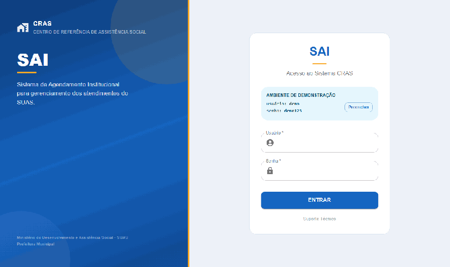

# SAI — Sistema de Agendamento Institucional

Gestão da fila de atendimento do CRAS: registro de chegada, acompanhamento em kanban, prioridade legal para idoso e PCD, e relatório de expediente em PDF.

[](https://github.com/NickDevD/SAI_API---Sistema-de-Agendamento-Institucional/actions/workflows/ci.yml)


<p align="center">
  
</p>

---

## Sobre

No CRAS, a fila de atendimento costuma ser controlada em papel e planilha. Quem chegou primeiro, quem tem prioridade legal, quem já foi atendido, quantas pessoas passaram no dia — tudo depende da memória do atendente e de um caderno.

O SAI organiza esse fluxo. A recepção registra a chegada do cidadão, o atendimento avança por um kanban visual, e o fechamento do expediente gera o relatório do dia em PDF.

Prioridade no SUAS não é preferência, é lei: idoso (Lei 10.741/03) e pessoa com deficiência têm direito ao atendimento prioritário. Por isso a prioridade não é um campo escondido no formulário — ela fica destacada no card, visível na fila o tempo todo.

## Funcionalidades

- Cadastro de atendimento com validação de CPF e classificação de prioridade
- Kanban com quatro estados: Aguardando, Em Atendimento, Concluído e Cancelado
- Autenticação JWT com dois papéis — `ADMIN` e `USER`
- Fechamento de expediente com geração de relatório em PDF
- CPF mascarado nas respostas da API, exposto por inteiro apenas no relatório oficial
- Ambiente de demonstração opcional, populado automaticamente

## Stack

| Camada | Tecnologia |
|--------|-----------|
| Backend | Java 21 · Spring Boot 4 |
| Segurança | Spring Security 7 · JWT (Auth0) |
| Persistência | PostgreSQL 16 · Flyway |
| Relatórios | iText 7 |
| Frontend | React 18 · TypeScript · Vite 7 · Material UI 5 |
| Infraestrutura | Docker · GitHub Actions |
| Deploy | Cloud Run · Firebase Hosting · Supabase |

## Arquitetura

```
├── backend/          API REST — Spring Boot 4 + PostgreSQL
├── front/            SPA — React 18 + TypeScript
├── relatorios/       PDFs gerados em runtime (volume Docker)
└── docker-compose.yml
```

```
backend/src/main/java/com/devtec/sai/
├── config/         Segurança, JWT, Flyway, seed de admin e demonstração
├── controller/     Endpoints REST
├── dto/            Contratos de entrada e saída
├── model/          Entidades JPA e enums
├── repository/     Spring Data JPA
└── service/        Regras de negócio, tokens e geração de PDF
```

## Executando localmente

**Pré-requisitos:** Docker e Docker Compose. Para rodar sem containers, Java 21, Maven e Node 20.

Crie o arquivo `.env` na raiz a partir do modelo:

```bash
cp .env.example .env
```

Preencha `POSTGRES_PASSWORD`, `JWT_SECRET` e as credenciais de administrador. Em seguida:

```bash
docker compose up --build -d
```

| Serviço | Endereço |
|---------|----------|
| Frontend | http://localhost:5173 |
| API | http://localhost:8080 |
| Swagger | http://localhost:8080/swagger-ui.html |

O usuário administrador é criado no primeiro boot a partir das variáveis do `.env`.

<details>
<summary>Rodar sem Docker</summary>

```bash
cd backend && ./mvnw spring-boot:run
```

```bash
cd front && npm install && npm run dev
```

O frontend espera `VITE_API_URL=http://localhost:8080` em `front/.env`.

</details>

### Ambiente de demonstração

Com `DEMO_SEED_ENABLED=true`, a aplicação cria o usuário `demo` e popula a base com seis atendimentos fictícios. O usuário demo tem papel `USER`: movimenta atendimentos, mas não fecha o expediente — operação restrita a `ADMIN` que apaga os registros do dia. Se a base ficar vazia, o seed é reposto automaticamente.

## Variáveis de ambiente

### Backend

| Variável | Obrigatória | Padrão | Descrição |
|----------|-------------|--------|-----------|
| `SPRING_DATASOURCE_URL` | Sim | `jdbc:postgresql://localhost:5432/agendamento_db` | URL JDBC do banco |
| `SPRING_DATASOURCE_USERNAME` | Sim | — | Usuário do PostgreSQL |
| `SPRING_DATASOURCE_PASSWORD` | Sim | — | Senha do PostgreSQL |
| `JWT_SECRET` | Sim | — | Chave de assinatura dos tokens |
| `CORS_ALLOWED_ORIGINS` | Não | `localhost:5173` e o host de produção | Origens liberadas, separadas por vírgula |
| `ADMIN_LOGIN_LINE` | Não | — | Login do administrador criado no boot |
| `ADMIN_PASSWORD_LINE` | Não | — | Senha do administrador |
| `RELATORIO_PATH` | Não | `/app/relatorios` | Diretório de saída dos PDFs |
| `DEMO_SEED_ENABLED` | Não | `false` | Ativa o ambiente de demonstração |
| `PORT` | Não | `8080` | Porta do servidor |

### Frontend

| Variável | Descrição |
|----------|-----------|
| `VITE_API_URL` | URL base da API, sem sufixo de caminho |
| `VITE_DEMO_LOGIN` | Login exibido na tela de login, quando houver demonstração |
| `VITE_DEMO_PASSWORD` | Senha exibida na tela de login |

As variáveis `VITE_*` são incorporadas ao bundle em tempo de build e não mudam sem uma nova compilação.

## API

Todas as rotas, exceto o login, exigem o header `Authorization: Bearer <token>`. O token expira em duas horas.

### Autenticação

| Método | Rota | Descrição | Acesso |
|--------|------|-----------|--------|
| `POST` | `/auth/login` | Autentica e retorna o token | Público |
| `POST` | `/auth/register` | Cadastra usuário | Autenticado |

```json
POST /auth/login
{ "login": "admin", "senha": "senha123" }

200 OK
{ "token": "eyJ..." }
```

### Agendamentos

| Método | Rota | Descrição | Acesso |
|--------|------|-----------|--------|
| `POST` | `/agendamentos/agendar` | Cria atendimento | Autenticado |
| `GET` | `/agendamentos/consultar_agendamentos` | Lista atendimentos | Autenticado |
| `POST` | `/agendamentos/{id}/status` | Atualiza o status | Autenticado |
| `POST` | `/agendamentos/fechar-expediente` | Gera o PDF e encerra o dia | `ADMIN` |

```json
POST /agendamentos/agendar
{
  "nomeSolicitante": "Maria Aparecida de Souza",
  "cpf": "52998224725",
  "rg": "1234567",
  "tipoServico": "BENEFICIO_PREVIDENCIARIO",
  "prioridade": "IDOSO",
  "dataHoraChegada": "2026-09-15T09:30"
}
```

**Domínios aceitos**

| Campo | Valores |
|-------|---------|
| `tipoServico` | `EMISSAO_DOCUMENTOS` · `BENEFICIO_PREVIDENCIARIO` · `CONSULTORIA_FINANCEIRA` · `SUPORTE_TECNICO` · `OUTROS` |
| `prioridade` | `NORMAL` · `IDOSO` · `PREFERENCIAL` · `PCD` |
| `status` | `AGUARDANDO` · `EM_ATENDIMENTO` · `CONCLUIDO` · `CANCELADO` |

O endpoint `/actuator/health` é público, para uso em health checks.

## Banco de dados

O schema é versionado com Flyway e aplicado na inicialização.

| Versão | Descrição |
|--------|-----------|
| V1 | Tabela `tb_agendamentos` |
| V2 | Tabela `tb_usuarios` |
| V3 | Coluna `prioridade` em `tb_agendamentos` |

O Flyway é orquestrado por `FlywayConfig.java` em vez da auto-configuração. No Spring Boot 4 a ordem padrão não garante que as migrations rodem antes da validação de schema do Hibernate, o que fazia a aplicação falhar no boot com `missing table/column`.

## Deploy

A aplicação roda em três serviços independentes: **Cloud Run** (API), **Firebase Hosting** (frontend) e **Supabase** (banco). O estado vive inteiramente fora do container, que pode ser descartado e recriado a qualquer momento.

**Backend.** A imagem é construída pelo Cloud Build e publicada no Artifact Registry; as senhas ficam no Secret Manager.

```bash
gcloud builds submit --tag us-central1-docker.pkg.dev/$PROJETO/sai-repo/sai-backend .

gcloud run deploy backend-api \
  --image us-central1-docker.pkg.dev/$PROJETO/sai-repo/sai-backend \
  --region us-central1 \
  --allow-unauthenticated \
  --memory 1Gi \
  --set-env-vars "SPRING_DATASOURCE_URL=jdbc:postgresql://$DB_HOST:5432/postgres?sslmode=require" \
  --set-env-vars "SPRING_DATASOURCE_USERNAME=$DB_USER,CORS_ALLOWED_ORIGINS=https://seu-site.web.app" \
  --set-secrets "SPRING_DATASOURCE_PASSWORD=sai-db-password:latest,JWT_SECRET=sai-jwt-secret:latest"
```

**Frontend.** A URL da API é incorporada ao bundle durante a compilação.

```bash
printf 'VITE_API_URL=%s\n' "$(gcloud run services describe backend-api --region us-central1 --format='value(status.url)')" > .env

npm ci && npm run build && firebase deploy --only hosting
```

O container precisa apenas escutar na porta indicada pela variável `PORT`, em `0.0.0.0` — contrato que `server.port=${PORT:8080}` já atende.

## CI

O workflow em `.github/workflows/ci.yml` roda a cada push em `main` e `develop`: sobe um PostgreSQL de serviço, compila o backend com Maven, executa os testes, e compila o frontend com lint.

## Licença

[MIT](LICENSE)

## Autor

**Nicholas Monteiro** — [GitHub](https://github.com/NickDevD)
